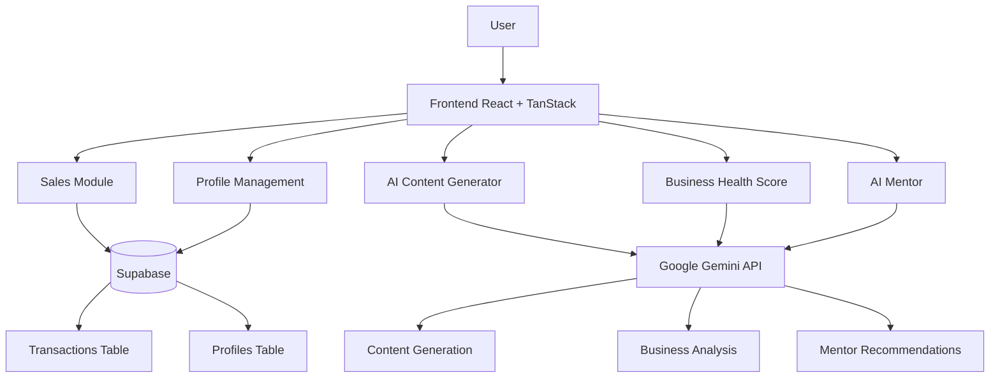

# Architecture Diagram

```mermaid
flowchart TD

A[User] --> B[Frontend React + TanStack]

B --> C[Sales Module]
B --> D[AI Content Generator]
B --> E[Business Health Score]
B --> F[AI Mentor]
B --> G[Profile Management]

C --> H[(Supabase)]

G --> H

H --> I[Transactions Table]
H --> J[Profiles Table]

D --> K[Google Gemini API]
E --> K
F --> K

K --> L[Content Generation]
K --> M[Business Analysis]
K --> N[Mentor Recommendations]
```